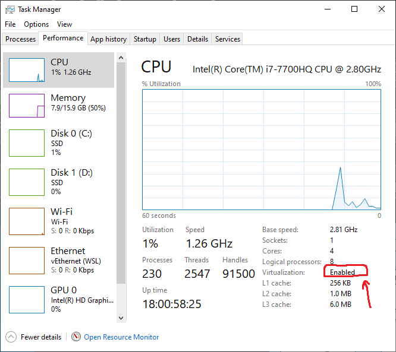
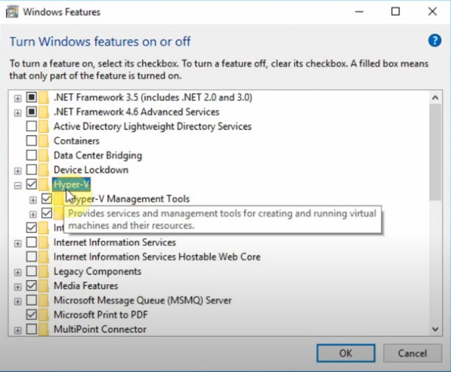
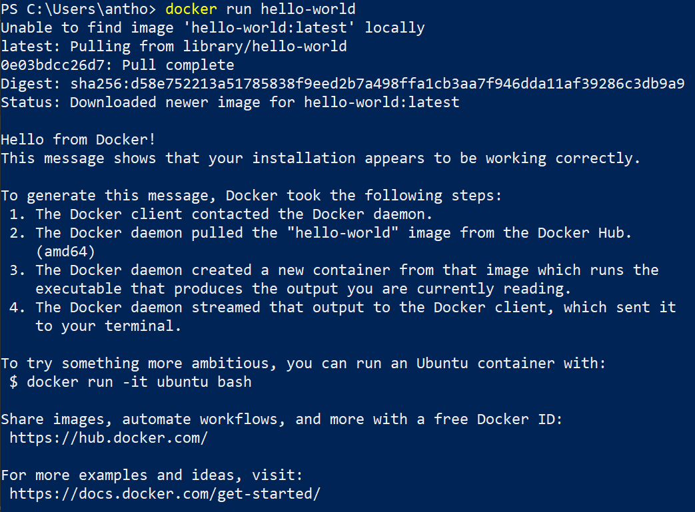
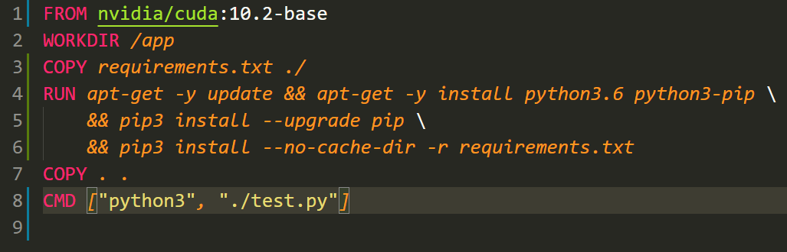
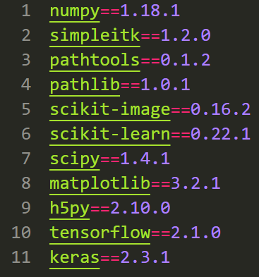
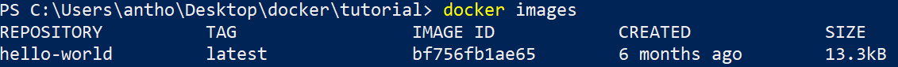
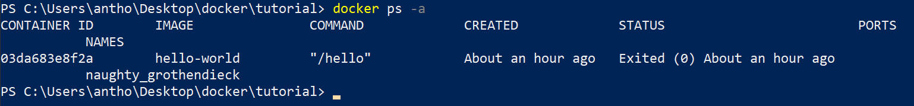
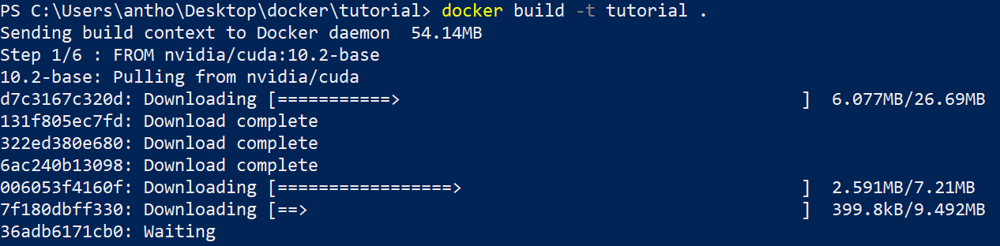
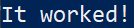

# Docker Tutorial


## What is Docker?


- Docker is a software development tool that solves the “it worked on my machine” problem
- It creates an isolated environment for your project, ensuring that no matter what device you deploy it on, it will run the same
- A much better alternative to virtual machines as Docker does not need to emulate an entire operating system


## How Does it Work?


- Docker uses blueprints known as “images” in order to determine what dependencies are needed for a certain application
- After reading the image file, Docker can create executable instances of the blueprint, and run them in containers
- Communication with the server is possible through the docker daemon


# Using Docker


## Step 1 – Docker Hub


- Docker Hub is the registry part of the architecture shown in the previous image
- It stores the images that you create so that you can pull and use them later
- Before downloading Docker, first we need to make a Docker Hub account
- To do so, use [this link](https://hub.docker.com/) and create your account
- Make sure to take note of your username as it will be tied to your future Docker images


## Step 2 - Preparing the Installation


- Before starting, we need to make sure that virtualization is enabled
- To do this, start your task manager (ctrl + alt + delete on Windows) and switch to the performance tab
- In the bottom right corner, make sure that virtualization is set to enabled (it usually is by default)





- Depending on the OS you are currently using, you may need check a few things
- If you are on Windows 10 Pro or Enterprise, makes sure that your Hypervisor is enabled
- To do this, type "optionalfeatures.exe" into your windows search box (bottom left corner)
- Scroll down to where it says Hyper-V, make sure you check the box and hit ok





## Step 3 - Installing Docker


- If you are using Windows 10 64-bit: Pro, Enterprise, or Education (Build 16299 or later), then you can safely download and install the Docker desktop version found [here](https://hub.docker.com/editions/community/docker-ce-desktop-windows/)
- Make sure you click the "Get Docker Desktop for Windows (stable)" option and follow the instructions that the setup file lays out for you
- If you are using an earlier version of windows, you will need to download and install the docker toolbox version found [here](https://github.com/docker/toolbox/releases)
- Make sure you download the latest .exe file when doing so


## Step 4 - Docker's Hello World


- With Docker installed, let's see if it is working correctly
- Start Docker using either your desktop app or the toolbox app (depending on which version you installed)
- Run Windows PowerShell and type in the command `docker run hello-world`
- You should get the following output:





## Step 5 - Dockerfiles


- In order to get the full experience of this tutorial, I would recommend cloning the tutorial folder or creating your own project folder and copying all of the files present in the tutorial folder into your project folder before moving on


- Having tested that Docker is working properly, we can now try and make our own Docker image
- To create a Docker image, we must write something called a Dockerfile
- Here is the Dockerfile that we will use for this tutorial:





- This file can also be found in the tutorial folder if you need to reference it
- **IT IS IMPORTANT THAT YOU NAME THIS FILE "Dockerfile" OR "dockerfile", IT CANNOT HAVE ANY OTHER NAME**
- Let us look at the code


- The first line, `FROM nvidia/cuda:10.2-base` means that we are using the image "nvidia/cuda" with the tag "10.2-base" as the basis for our own docker image
- So in other words, we are not starting from scratch, but using this docker image as a template for which we will add on our own dependencies later
- This particular Docker image can be found on the Docker Hub [here](https://hub.docker.com/r/nvidia/cuda/tags)  
- Note that we are using the 10.2-base tag


- The second line, `WORKDIR /app` creates a working directory in the container that is called app
- If we were to initalize a bash shell in the container, the directory we would be in is the app folder


- The third line, `COPY requirements.txt ./` copies our requirements.txt file into the current directory of the container
- Note that since we initialized our working directory to be the app folder, the requirements.txt file will be copied into the container inside the app directory


- Next, lines 4, 5, and 6,
    ```
    RUN apt-get -y update && apt-get -y install python3.6 python3-pip \
    && pip3 install --upgrade pip \
    && pip3 install --no-cache-dir -r requirements.txt
    ```
- These lines are used to run some Linux-based software to install some dependencies
- For example, `apt-get -y update && apt-get -y install python3.6 python3-pip` is saying this: "Update the Linux function `apt-get` and use it to install python3.6 and python3-pip"
- A single `RUN` keyword can execute many commands and when possible, you should try and squeeze in as many commands as you can into one `RUN` statement
- This is because when you use multiple `RUN` statements, you are creating more layers which leads to an image file that uses significantly more memory than it needs to
- at the end of line 4, we have the `\` character symbolizing the end of the line (note that each command is separated by `&&` and only when a new line is created we use `\`)
- Line 5 is simply upgrading the pip tool that was previously installed with apt-get
- Line 6 is responsible for pip installing the dependencies listed in the requirements.txt document
- If you copied all of the files in the tutorial folder into your separate project folder, you should have a requirements.txt file that looks like this:





- After this step is complete, the container should have recently added python3.6 pip3 and all of the dependencies listed in the requirements.txt document


- Line 7, `COPY . .`, copies the remaining files and folders not yet copied in your current directory on your home computer, into the working directory of the container


- Finally, line 8, `CMD ["python3", "./test.py"]` initializes a command to be run when the docker container begins it's execution
- The command in question here would be `python3 ./text.py`


## Side Note on Useful Docker PowerShell Commands


- This is a list of commands that I frequently used when I was developing with Docker


- `docker images`: lists the images that you have downloaded
- `docker ps -a `: lists the containers that you have either running or haulted (note that -a means show me all of the containers as some can run in the background and not show up if you just type `docker ps`)
- `docker tag (image id) (your username)/(name of image):(name of tag)`: associates a tag to your image, (usually used for specifying versions of an image)
- `docker push (your username)/(name of image):(name of tag)`: pushes your image to the Docker Hub
- `docker pull (name of image):(name of tag)`: pulls an image from the Docker Hub
- `docker run (name of image)`: runs the image specified in a container
- `docker build -t (name of image) (directory where to start building)`: builds the image from the specified dockerfile. The `-t` here means that you want to tag the image with some name. Note that if you want to build the image from your current working directory, you can use `.` to specify that (will show in the example later)
- `docker rm (container id)`: removes the specified container
- `docker rmi (image id)`: removes the specified image
- `docker system prune -a`: deletes all containers and images (must press y/n to say yes or no after inputting)
- `docker cp (container id):(/file/path/within/container) (/host/path/target)`: copies file from container onto host computer (example done in step 7)
- `docker --help`: Lists all docker commands
- `docker (command name) --help` lists all modifiers that a command can have (ie. -t means tage, --rm means remove after execution etc.)


## Step 6 Creating the Image


- Now that we have made our Dockerfile, we can create our image
- Navigate to Windows Powershell and change directories until you are in the directory with the Dockerfile
- If you are completing this step after checking if Docker was working properly, type in the command `docker images` and something like this should come up:





- This shows that the hello-world image is still taking up space on the computer
- We can also run the command `docker ps -a` to see the container that the hello-world process was run in





- To remove these from memory, use the commands `docker rm (container id)` to remove the container and `docker rmi (image id)` to remove the image
- In this example, I would write `docker rm 03da683e8f2a` and `docker rmi bf756fb1ae65` to remove them


- With everything cleared up, it is time to create our Docker image
- While in the directory your Dockerfile is in, run the command `docker build -t (name of image) .` (make sure to include the period as it correspondds to the current working directory)
- In my example I will write `docker build -t tutorial .`


- Once the command executes, you should see something like this in PowerShell:





- Now we must wait until all 6 of the steps are finished (note that the number of steps and what is done at each step corresponds to how the Dockerfile is constructed)


- After the steps have been completed, type `docker run (name of image)` into the command line
- In my case, I would write `docker run tutorial`
- There will be a lot of tensorflow messages but the final line of the output should be as follows:





- If you see this, the project worked correctly!


## (Bonus) Step 7 Copying the Output to Your Computer


- The Python script that we used in this project performed image segmentation from an MRI scan of the brain
- At the end of the script, you may have noticed that there was a figure saved into the prediction folder
- In order to retrieve that figure, we can use the command `docker cp (container id):(/file/path/within/container) (/host/path/target)`
- In my case, since my container id is "8dd3add3db8a", the path where the figure was saved was "/app/prediction/sample.png", and I would like to copy the image to the images folder, I would input the command `docker cp 8dd3add3db8a:/app/prediction/sample.png /Users/antho/Desktop/docker/tutorial/images`
- After this command executes, when I check my images folder, I have a new file called sample.png that looks like this:


## Step 8 Pushing Your Image to the Docker Hub


- In order to save your image for later use, we can push it onto the Docker Hub
- to do so, first we need to tag our image by using the `docker tag (image id) (your username)/(name of image):(name of tag)` command
- Here, I since my image id is "e9eff0a4cc99", my username is "anthonyolijnyk", the name of the image is "tutorial" and the tag I would like to put is "latest" I will use the command `docker tag e9eff0a4cc99 anthonyolijnyk/tutorial:latest`
- After this executes, all I have to do is use the command `docker push (your username)/(name of image):(name of tag)` to finish pushing it to the Docker Hub
- In my case, I will write the command `docker push anthonyolijnyk/tutorial:latest`
- After the process finishes, the image will have successfully been added to the repositories section of your Docker Hub page, mine is [here](https://hub.docker.com/repository/registry-1.docker.io/anthonyolijnyk/tutorial/tags?page=1)


## Step 9 Pulling From the Docker Hub


- In order to pull an image from the Docker Hub, you must use the command `docker pull (name of image):(name of tag)` to do so
- If I wanted to pull the image that I had just pushed to the Docker Hub, I would use the command `docker pull anthonyolijnyk/tutorial:latest`


## (Bonus) A Couple of Tips


- When you are done with an image or container, make sure to remove it as it can take up the limited amount of space you have for them
- When building images from Dockerfiles, often times they do not work on the first run through. To save yourself time troubleshooting, do not delete the base image when rebuilding. This will save you the `FROM` step which is commonly very long
- Try and make use of the `--rm` tag when using containers. This tag removes the container after it is finished executing which is very helpful and prevents the hassle of having multiple containers taking up a lot of memory for no reason
- The `-it` tag can be used to explore the container directory when no `CMD` line is set in the Dockerfile. If you were to remove the `CMD` line from the Dockerfile used in the tutorial, then write the command `docker run -it tutorial` you would see that you enter a bash shell in the app directory of the container. From there, you would be free to explore it
